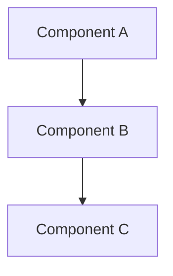

# Documentation Patterns

## Quick Reference

| Doc Type | Location | Format |
|----------|----------|--------|
| README | `README.md` | Markdown |
| API docs | Code comments | Rustdoc/JSDoc/Docstring |
| Changelog | `CHANGELOG.md` | Keep a Changelog |
| Architecture | `docs/architecture.md` | Markdown + Mermaid |

## README Structure

```markdown
# Project Name

One-line description.

## Features

- Feature 1
- Feature 2

## Installation

[Minimal install steps]

## Quick Start

[Copy-paste example that works]

## Usage

[Common use cases]

## API

[Key functions with examples]

## Contributing

[Link to CONTRIBUTING.md]

## License

[License type]
```

## API Documentation

### Rust (Rustdoc)

```rust
/// Creates a new conductor with default configuration.
///
/// # Examples
///
/// ```
/// let conductor = Conductor::new();
/// ```
///
/// # Panics
///
/// Panics if the runtime cannot be initialized.
pub fn new() -> Self { ... }

/// Executes a chain of operations.
///
/// # Arguments
///
/// * `chain` - The chain to execute
///
/// # Returns
///
/// Returns `Ok(T)` on success, `Err(Error)` on failure.
///
/// # Errors
///
/// Returns an error if any operation in the chain fails.
pub fn execute<T>(&self, chain: Chain<T>) -> Result<T, Error> { ... }
```

### TypeScript (JSDoc)

```typescript
/**
 * Creates a new conductor with default configuration.
 * 
 * @example
 * ```ts
 * const conductor = new Conductor();
 * ```
 * 
 * @throws {Error} If runtime cannot be initialized
 */
constructor() { ... }

/**
 * Executes a chain of operations.
 * 
 * @param chain - The chain to execute
 * @returns Promise resolving to the result
 * @throws {ChainError} If any operation fails
 */
async execute<T>(chain: Chain<T>): Promise<T> { ... }
```

### Python (Docstrings)

```python
def execute(self, chain: Chain[T]) -> T:
    """Execute a chain of operations.
    
    Args:
        chain: The chain to execute.
    
    Returns:
        The result of the chain execution.
    
    Raises:
        ChainError: If any operation fails.
    
    Example:
        >>> conductor = Conductor()
        >>> result = conductor.execute(chain)
    """
```

## Changelog Format

```markdown
# Changelog

## [Unreleased]

### Added
- New feature X

### Changed
- Updated behavior of Y

### Fixed
- Bug in Z

## [1.0.0] - 2025-01-15

### Added
- Initial release
```

## Architecture Docs

```markdown
# Architecture

## Overview

[One paragraph summary]

## Components

[Mermaid diagram]



## Data Flow

[How data moves through the system]

## Key Decisions

[Link to ADRs]
```

## Code Comments

### When to Comment

```rust
// ✅ Good: Explain WHY
// Using slab allocator to avoid heap fragmentation
// in long-running processes
let allocator = SlabAllocator::new();

// ❌ Bad: Explain WHAT (code already does this)
// Create a new slab allocator
let allocator = SlabAllocator::new();
```

### SAFETY Comments (Rust)

```rust
// SAFETY:
// - ptr is non-null (checked above)
// - ptr is aligned (guaranteed by allocator)
// - memory is initialized (set in previous loop)
unsafe { *ptr }
```

### TODO Comments

```rust
// TODO(username): Brief description
// TODO(#123): Link to issue
// FIXME: Known problem to address
// HACK: Temporary workaround
```

## Documentation Checklist

- [ ] README has working quick start example
- [ ] All public APIs have doc comments
- [ ] Examples compile and run
- [ ] CHANGELOG is up to date
- [ ] No broken links

## Anti-patterns

❌ Outdated documentation
❌ Examples that don't compile
❌ Explaining what code does (not why)
❌ Missing error documentation
❌ No examples for complex APIs
❌ Documentation in wrong language (match codebase)